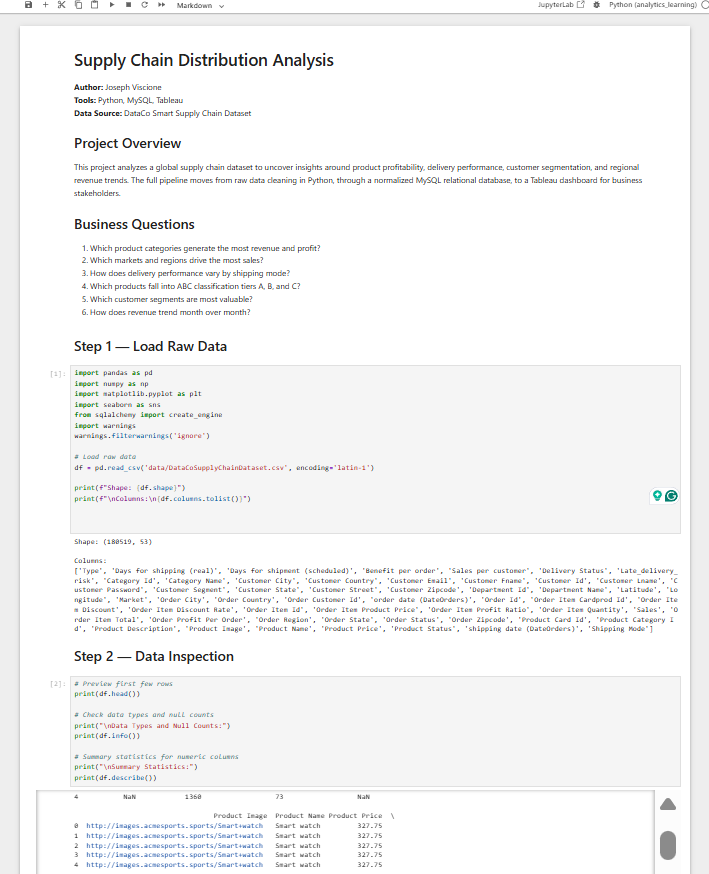
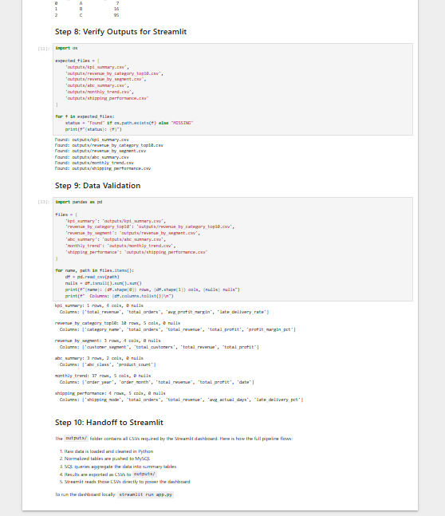
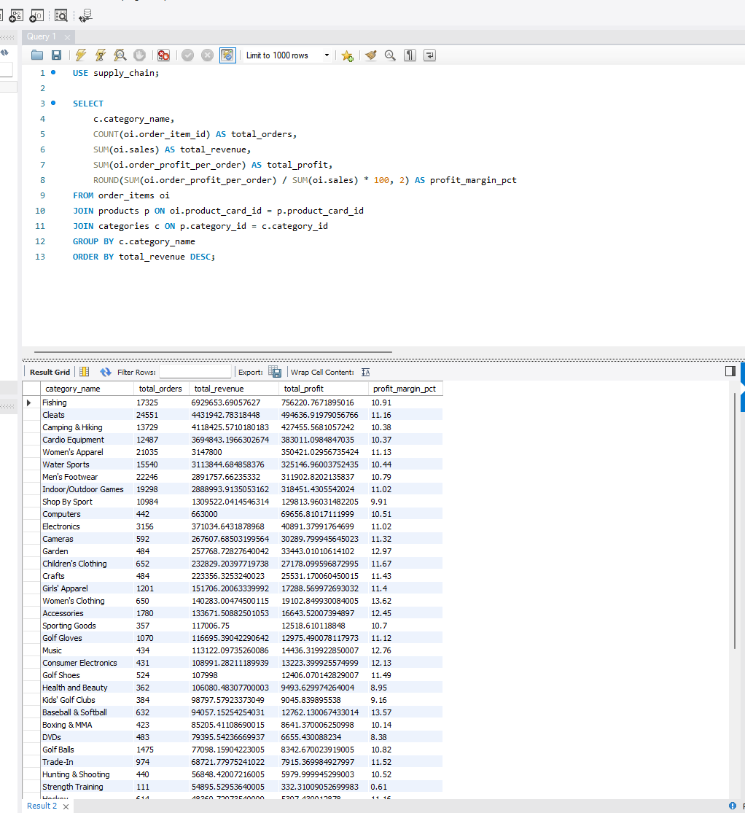
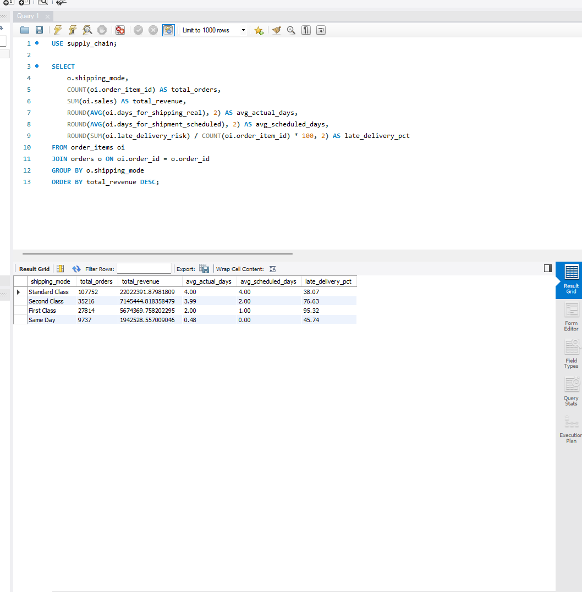
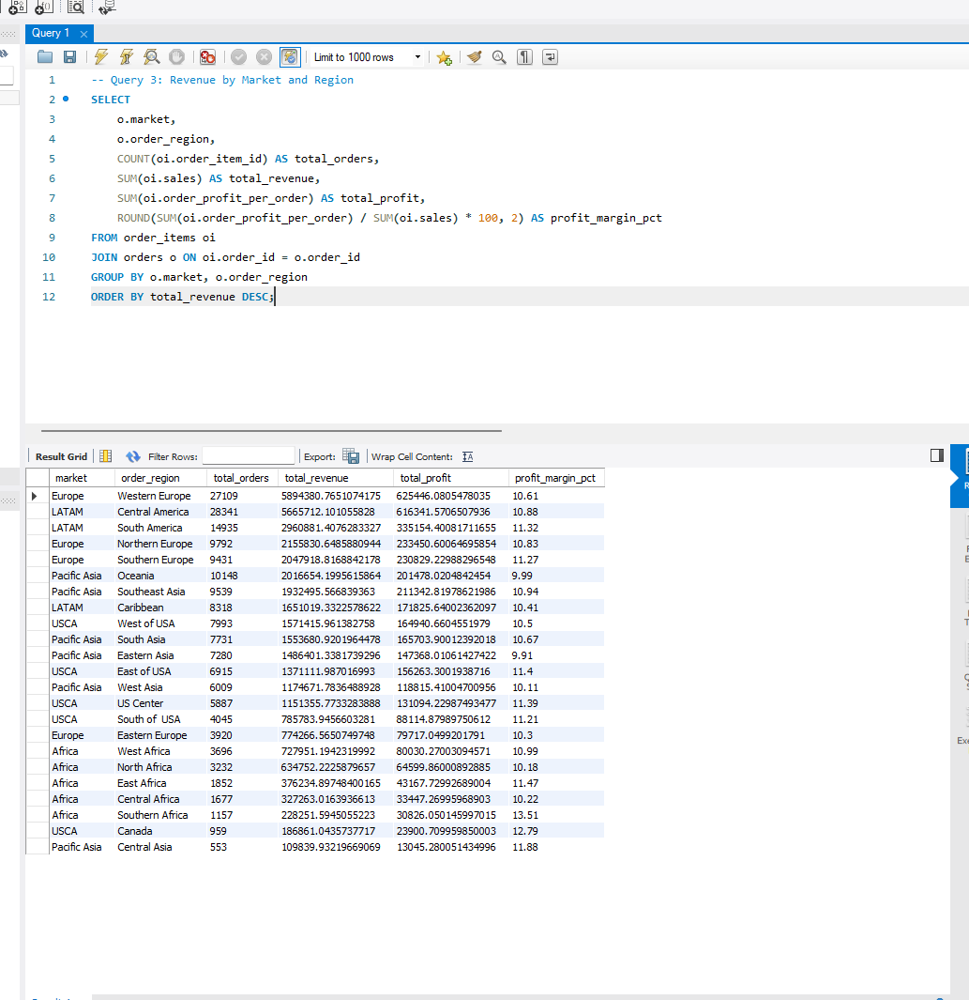
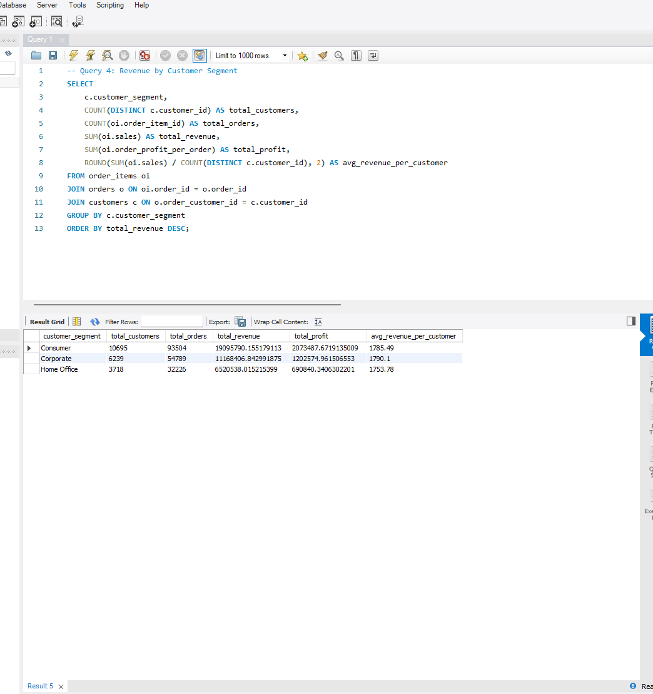
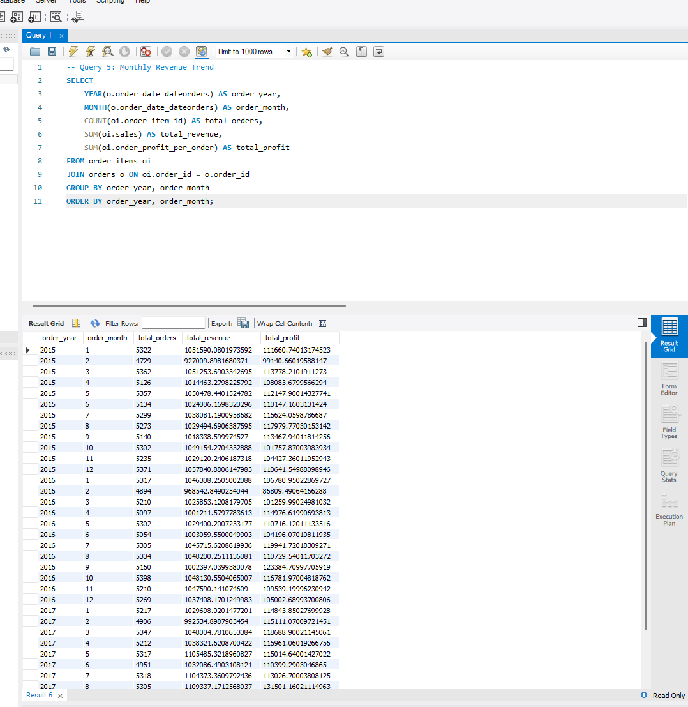
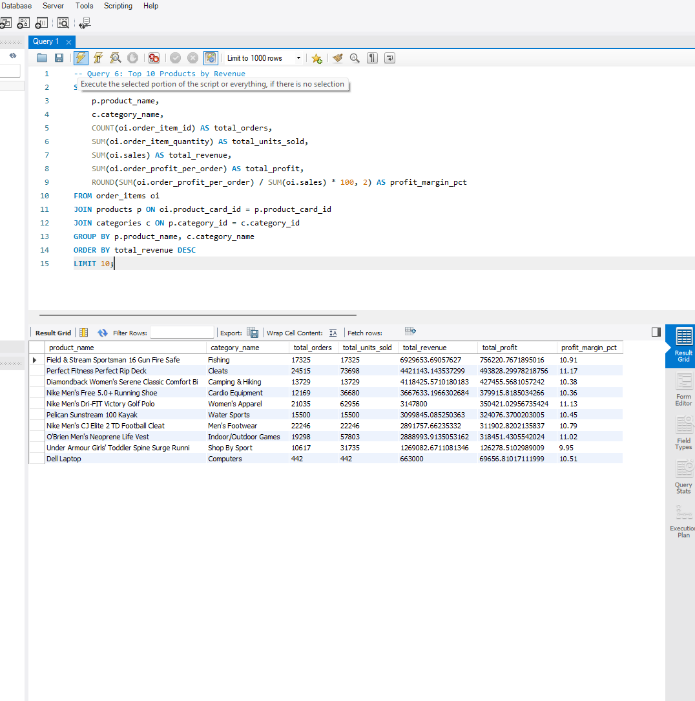
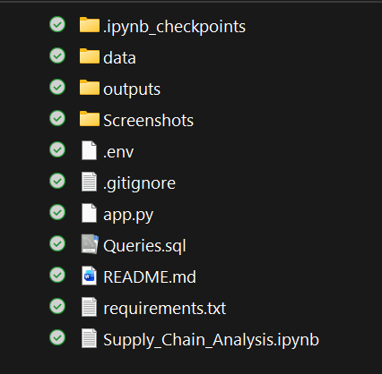

# Supply Chain Performance Analysis

**Author:** Joseph Viscione  
**Tools:** Excel, Python, MySQL, Streamlit  
**Data Source:** DataCo Smart Supply Chain Dataset

---

## Live Dashboard

[Click here to view the interactive dashboard](https://supply-chain-performance.streamlit.app)

---

## Project Overview

This project analyzes a global supply chain dataset to uncover insights around product profitability, delivery performance, customer segmentation, and regional revenue trends. The full pipeline moves from raw data cleaning in Python, through a normalized MySQL relational database, to an interactive Streamlit dashboard for business stakeholders.

---

## Business Questions

- Which product categories generate the most revenue and profit?
- Which markets and regions drive the most sales?
- How does delivery performance vary by shipping mode?
- Which products fall into ABC classification tiers A, B, and C?
- Which customer segments are most valuable?
- How does revenue trend month over month?

---

## Project Pipeline

Raw CSV (180K rows)  
↓  
Python (pandas) — data cleaning, normalization, ABC classification  
↓  
MySQL — 5 normalized tables (customers, categories, products, orders, order_items)  
↓  
SQL Queries — 6 aggregation queries exported as CSVs  
↓  
Streamlit — Interactive Dashboard

---

## Python ETL Pipeline

### Loading Raw Data

### Validating CSV Exports for Streamlit

All six required files were successfully generated and validated:
- `kpi_summary.csv`
- `revenue_by_category_top10.csv`
- `revenue_by_segment.csv`
- `abc_summary.csv`
- `monthly_trend.csv`
- `shipping_performance.csv`

---

## SQL Query Examples

The following queries were executed in MySQL Workbench to aggregate and analyze the normalized supply chain data.

### Query 1: Revenue and Profit by Product Category

### Query 2: Revenue and Delivery Performance by Shipping Mode

### Query 3: Revenue by Market and Region

### Query 4: Revenue by Customer Segment

### Query 5: Monthly Revenue Trend

### Query 6: Top 10 Products by Revenue

---

## Key Insights

- **ABC Classification:** 7 products (Class A) drive 80% of total revenue, while 95 products (Class C) contribute just 5%. Inventory and forecasting efforts should prioritize the Class A group.

- **Shipping Performance:** Second Class shipping has the highest late delivery rate at 76.6%, despite handling significantly fewer orders than Standard Class. This represents a clear operational bottleneck.

- **Customer Segments:** Consumer customers generate 52% of total revenue, followed by Corporate at 30% and Home Office at 18%. Marketing and retention efforts are best focused on the Consumer segment.

- **Revenue Trend:** Monthly revenue shows consistent growth through 2016, with seasonal peaks suggesting opportunity for targeted promotional planning during high-volume periods.

---

## Project Structure

---

## How to Run Locally

1. Clone this repository
2. Install dependencies: `pip install -r requirements.txt`
3. Run the dashboard: `streamlit run app.py`